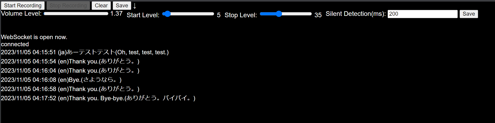

# Faster Whisperサーバー


[*faster*-*whisper*](https://github.com/guillaumekln/faster-whisper) とは、 OpenAI の 音声認識モデルWhisperを高速化したものです。 GPUを使えば、精度が高いのにもかかわらずリアルタイム翻訳ができる便利なものです。

これとDeepL(AI翻訳)を組み合わせてリアルタイム翻訳機を作ったら非常に便利だったので公開します。

クライアント側は、javascriptで作っており、音声の切れ目を検出してサーバに音声データを送信して、認識結果と翻訳結果を表示します。


## サーバー起動方法

```
python websocket_server.py
```

CUDAのセットアップとGPUのVRAMが5GBくらい必要です。クライアントと同じコンピュータで実行すること。(localhost接続しかためしてない)


## 設定

settings.pyにDeepLのAPIキーを設定してください。翻訳先の言語も指定できます。

```
DEVICE = "cuda" if torch.cuda.is_available() else "cpu"
DEEPL_API_KEY = "DeepL API Key"  # DeepL API key
TRANSLATION_TARGET_LANGUAGE = "JA"  # 翻訳先の言語コード（例：'en', 'ja', 'es'）
TRANSLATION_SOURCE_LANGUAGE = "EN"  # 翻訳先の言語コード（例：'en', 'ja', 'es'）
```


## 実行方法

ウェブブラウザで**/client/index.html**を開く。接続先がlocalhost固定になっているので、サーバと同じコンピュータで実行すること。
サーバーに接続できたら、マイクの音を自動でどんどん翻訳していってくれます。



Start Level以上の音量になったら録音して、Stop Level以下の音量になってSilent Detection(ミリ秒)経過したら、音声が途切れたと判断して、認識＆翻訳にデータを流します。ボリュームレベルを見ながら設定を変えてみてください。


### StartRecordingボタン
最初の１回押して、権限の許可をしたら、音声を認識したら自動で翻訳を続けます。
### StopRecordingボタン
一旦、音声を区切って認識＆翻訳をかけたいときに押してください

### Volume Level
現在のマイクの入力レベル
### Start Level
これ以上の音量になったら自動で録音を開始します。
### Stop Level
これ以下の音量になったら自動で録音を停止し認識をはじめます。
### Clearボタン
履歴の消去
### Saveボタン
翻訳結果のテキストをダウンロード


## ライセンス
MIT
