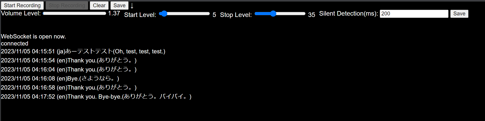

# Faster Whisper Server


[*faster*-*whisper*](https://github.com/guillaumekln/faster-whisper) is a faster version of OpenAI's speech recognition model Whisper. Using a GPU, it is useful for real-time speech recognition despite its high accuracy.

I combined this with DeepL(AI translation) to create a real-time translator and it was very useful, so I am publishing it.

The client side is made with javascript, detects breaks in the audio, sends the audio data to the server, and displays the recognition and translation results.

Youtube: https://www.youtube.com/watch?v=Z9dHLUZvD1E


## Server Startup Method

```
python websocket_server.py
```

Setting up CUDA and about 5GB of GPU VRAM are required. Run on the same computer as the client. (Only tested with localhost connection)


## Configuration

Configure the API key of DeepL in settings.py. You can also specify the target language.

```
DEVICE = "cuda" if torch.cuda.is_available() else "cpu"
DEEPL_API_KEY = "DeepL API Key"  # DeepL API key
TRANSLATION_TARGET_LANGUAGE = "JA" # Language code of the target language (e.g. 'en', 'ja', 'es')
TRANSLATION_SOURCE_LANGUAGE = "EN" # Destination language code (e.g. 'en', 'ja', 'es')
```


## Execution Method

Open **/client/index.html** in a web browser. Since the connection destination is fixed to localhost, run on the same computer as the server.
Once connected to the server, it will automatically continue translating the sound from the microphone.



When the volume is above Start Level, it records, and when the volume is below Stop Level and Silent Detection (milliseconds) has elapsed, it determines that the voice has been interrupted, and the data is sent to Recognition & Translation. Try changing the setting while watching the volume level.


### StartRecording button

Press this button once for the first time to allow authorization, and once the voice is recognized, it will automatically continue translating.

### StopRecording button

Press this button when you want to stop recording and start translation.

### Volume Level

Current microphone input level.

### Start Level

Start recording automatically when the volume level is higher than this level.

### Stop Level

When the volume level becomes lower than this level, recording will automatically stop and recognition will begin.

### Clear Button

Clear history.

### Save button

Download the translated text.


## License

MIT
